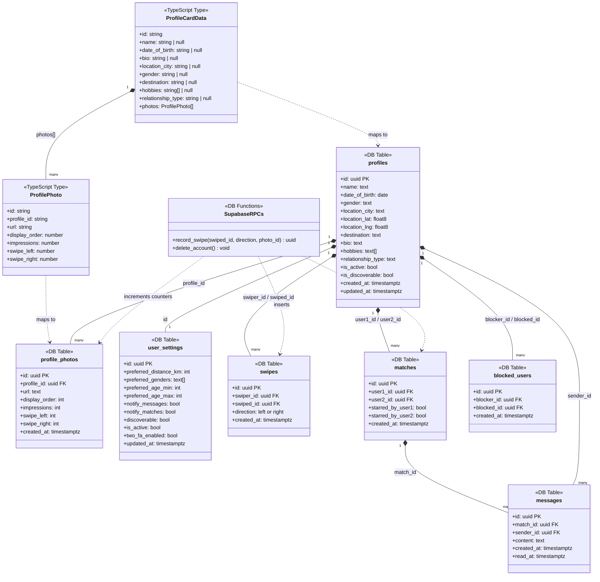
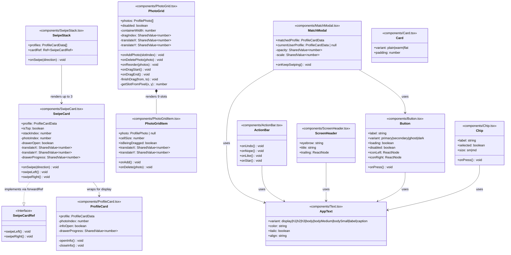
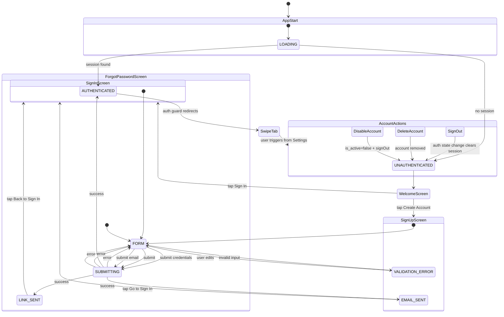

# Destined — Class Diagram & State Charts

> Generated from codebase analysis. Rendered by any Mermaid-compatible viewer (GitHub, VS Code with Mermaid extension, etc.)

---

## 1. Class Diagram — Data Layer



---

## 2. Class Diagram — Hooks, Context & Utility

```mermaid
classDiagram
    direction TB

    class supabase {
        <<Singleton Client>>
        +auth: GoTrueClient
        +from(table) QueryBuilder
        +storage: StorageClient
        +rpc(fn, params) RPCBuilder
    }

    class AuthContext {
        <<React Context>>
        +session: Session | null
    }

    class RootLayout {
        <<app/_layout.tsx>>
        -session: Session | null
        -loading: boolean
        -fontsLoaded: boolean
        +useAuth() Session | null
        -initSession() void
        -subscribeAuthChanges() Subscription
    }

    class AuthGuard {
        <<Inner Component>>
        -segments: string[]
        -watchEffect() void
        -redirectToWelcome() void
        -redirectToSwipe() void
    }

    class useSwipeQueue {
        <<Custom Hook>>
        -queue: ProfileCardData[]
        -isLoading: boolean
        -error: string | null
        -matchedProfile: ProfileCardData | null
        -isRefilling: MutableRef~boolean~
        +currentProfile: ProfileCardData
        +nextProfiles: ProfileCardData[]
        +isEmpty: boolean
        +recordSwipe(direction) Promise~void~
        +clearMatch() void
        +retry() void
        -fetchSettings() FilterSettings
        -fetchProfiles() ProfileCardData[]
        -initialLoad() void
    }

    class SwipeQueueResult {
        <<Return Type>>
        +currentProfile: ProfileCardData | undefined
        +nextProfiles: ProfileCardData[]
        +isLoading: boolean
        +isEmpty: boolean
        +error: string | null
        +matchedProfile: ProfileCardData | null
        +recordSwipe(direction) void
        +clearMatch() void
        +retry() void
    }

    RootLayout --> AuthContext : provides
    RootLayout *-- AuthGuard : contains
    AuthGuard --> AuthContext : consumes
    RootLayout --> supabase : auth.getSession, onAuthStateChange

    useSwipeQueue --> AuthContext : useAuth (userId)
    useSwipeQueue --> supabase : queries profiles, swipes, user_settings; rpc record_swipe
    useSwipeQueue ..> SwipeQueueResult : returns
```

---

## 3. Class Diagram — Components



---

## 4. Class Diagram — Screens

```mermaid
classDiagram
    direction LR

    class SwipeScreen {
        <<app/(tabs)/swipe.tsx>>
        -topCardRef: Ref~SwipeCardRef~
        -currentUserProfile: ProfileCardData | null
        -filterSettings: FilterSettings
        -recentMatchPhotos: string[]
        +handleSwipe(direction) void
        +handleButtonSwipe(direction) void
    }

    class LikesScreen {
        <<app/(tabs)/likes.tsx>>
        -likers: ProfileCardData[]
        -loading: boolean
        -selected: ProfileCardData | null
        -actionLoading: boolean
        -matchedProfile: ProfileCardData | null
        -currentUserProfile: ProfileCardData | null
        +handleAction(direction) void
        -load() void
    }

    class MatchesScreen {
        <<app/(tabs)/matches.tsx>>
        -conversations: ConversationItem[]
        -newMatches: ConversationItem[]
        -loading: boolean
        -error: string | null
        +openChat(item) void
        -load() void
    }

    class ConversationItem {
        <<Local Type>>
        +matchId: string
        +partnerId: string
        +partnerName: string
        +partnerPhoto: string
        +destination: string
        +lastMessage: string
        +time: string
        +unread: number
        +isNewMatch: boolean
        +starred: boolean
        +isUser1: boolean
    }

    class ProfileScreen {
        <<app/(tabs)/profile.tsx>>
        -profile: Profile | null
        -photos: ProfilePhoto[]
        -form: FormState
        -loading: boolean
        -saving: boolean
        -photoLoading: boolean
        -scrollEnabled: boolean
        -hobbyInput: string
        +hasChanges: boolean
        +handleSave() void
        +handleAddPhoto(slotIndex) void
        +handleDeletePhoto(photo) void
        +handleReorder(photos) void
        -loadData() void
    }

    class SettingsScreen {
        <<app/(tabs)/settings.tsx>>
        -discoverySettings: DiscoverySettings
        -notificationSettings: NotificationSettings
        -blockedUsers: BlockedUser[]
        -discoveryVisible: boolean
        -notificationsVisible: boolean
        -blockedVisible: boolean
        +handleSignOut() void
        +handleDeleteAccount() void
        +handleDisableAccount() void
        +handleChangePassword() void
    }

    class SignInScreen {
        <<app/(auth)/sign-in.tsx>>
        -email: string
        -password: string
        -loading: boolean
        -error: string | null
        +handleSignIn() void
    }

    class SignUpScreen {
        <<app/(auth)/sign-up.tsx>>
        -email: string
        -password: string
        -confirm: string
        -loading: boolean
        -success: boolean
        +handleSignUp() void
    }

    class ForgotPasswordScreen {
        <<app/(auth)/forgot-password.tsx>>
        -email: string
        -loading: boolean
        -sent: boolean
        +handleReset() void
    }

    SwipeScreen --> useSwipeQueue : uses
    SwipeScreen --> SwipeStack : renders
    SwipeScreen --> ActionBar : renders
    SwipeScreen --> MatchModal : renders conditionally
    LikesScreen --> ProfileCard : renders in modal
    LikesScreen --> MatchModal : renders conditionally
    ProfileScreen --> PhotoGrid : renders
    MatchesScreen ..> ConversationItem : uses locally

    SwipeScreen ..> supabase : profiles, matches, user_settings
    LikesScreen ..> supabase : swipes, rpc record_swipe
    MatchesScreen ..> supabase : matches, messages
    ProfileScreen ..> supabase : profiles, profile_photos, storage
    SettingsScreen ..> supabase : user_settings, blocked_users, auth
    SignInScreen ..> supabase : auth.signInWithPassword
    SignUpScreen ..> supabase : auth.signUp
    ForgotPasswordScreen ..> supabase : auth.resetPasswordForEmail
```



---

## 5. State Chart — Authentication Flow



---

## 6. State Chart — Swipe Queue (useSwipeQueue Hook)

```mermaid
stateDiagram-v2
    [*] --> IDLE_LOADING : hook mounts with userId

    IDLE_LOADING --> DISPLAYING : fetchProfiles() → non-empty queue
    IDLE_LOADING --> EMPTY : fetchProfiles() → empty result
    IDLE_LOADING --> ERROR : fetchProfiles() throws

    state DISPLAYING {
        [*] --> ShowingCard
        ShowingCard --> Swiping : user swipes / button press
        Swiping --> ShowingCard : queue advances (no match)
        Swiping --> MATCHED_OVERLAY : record_swipe returns matchId
        Swiping --> [*] : queue depletes → EMPTY
    }

    state BackgroundRefill {
        note right of BackgroundRefill
            Triggered when queue.length ≤ 5
            Deduplicates and appends new profiles
        end note
    }

    DISPLAYING --> BackgroundRefill : queue ≤ REFILL_THRESHOLD
    BackgroundRefill --> DISPLAYING : new profiles appended

    MATCHED_OVERLAY --> DISPLAYING : clearMatch() (user dismisses)
    MATCHED_OVERLAY --> EMPTY : clearMatch() + queue depleted

    EMPTY --> IDLE_LOADING : retry() called
    ERROR --> IDLE_LOADING : retry() called
```

---

## 7. State Chart — SwipeCard Component

```mermaid
stateDiagram-v2
    [*] --> IDLE

    state IDLE {
        note right of IDLE
            isTop=true, drawer closed
            Gesture handler active
        end note
    }

    IDLE --> PANNING : pan gesture starts (isTop=true, drawer closed)
    IDLE --> FLYING_OFF : swipeLeft() / swipeRight() via ref
    IDLE --> DRAWER_OPEN : info button pressed

    state PANNING {
        [*] --> Dragging
        Dragging --> SpringBack : pan ends, |translateX| ≤ 120
        Dragging --> FLYING_OFF : |translateX| > 120
        SpringBack --> [*]
    }

    state FLYING_OFF {
        [*] --> Animating
        Animating --> Removed : translateX off-screen → onSwipe fires
    }

    state DRAWER_OPEN {
        note right of DRAWER_OPEN
            Pan gesture disabled
            drawerProgress animated to 1
        end note
        [*] --> InfoVisible
        InfoVisible --> Closing : close / backdrop pressed
        Closing --> [*] : drawerProgress → 0 over 220ms
    }

    DRAWER_OPEN --> IDLE : drawer closes
    PANNING --> IDLE : spring back completes

    state PhotoNavigation {
        note right of PhotoNavigation
            Available from IDLE and DRAWER_OPEN (photo strip)
            Tap left half → prev photo
            Tap right half → next photo
        end note
    }
```

---

## 8. State Chart — Profile Screen

```mermaid
stateDiagram-v2
    [*] --> LOADING : screen mounts

    LOADING --> VIEWING : loadData() resolves
    LOADING --> VIEWING_WITH_ERROR : loadData() fails

    state VIEWING {
        note right of VIEWING
            form === profile snapshot
            hasChanges = false
            Save button disabled
        end note
    }

    VIEWING --> DIRTY : user edits any field
    VIEWING --> PHOTO_UPLOADING : user taps empty photo slot
    VIEWING --> PHOTO_DELETING : user taps delete on photo
    VIEWING --> PHOTO_REORDERING : user drags to reorder

    state DIRTY {
        note right of DIRTY
            form !== profile snapshot
            hasChanges = true
            Save button enabled
        end note
    }

    DIRTY --> SAVING : tap Save Changes
    DIRTY --> VIEWING : edits reverted to match snapshot

    state SAVING {
        [*] --> Uploading
        Uploading --> SaveSuccess : profiles.update() resolves
        Uploading --> SaveError : update fails
        SaveSuccess --> [*]
        SaveError --> [*]
    }

    SAVING --> VIEWING : save success (profile snapshot updated)
    SAVING --> DIRTY : save error (user can retry)

    state PHOTO_UPLOADING {
        [*] --> PickerOpen
        PickerOpen --> Uploading : image selected
        PickerOpen --> [*] : picker cancelled
        Uploading --> [*] : storage.upload + insert resolves
        Uploading --> [*] : error (banner shown)
    }

    PHOTO_UPLOADING --> VIEWING : photo added
    PHOTO_DELETING --> VIEWING : photo removed, display_order resequenced
    PHOTO_REORDERING --> VIEWING : onReorder() updates display_order
```

---

## 9. State Chart — Likes Screen

```mermaid
stateDiagram-v2
    [*] --> LOADING : screen mounts

    LOADING --> BROWSING_GRID : load() resolves with likers
    LOADING --> EMPTY : load() resolves, no likers

    state BROWSING_GRID {
        note right of BROWSING_GRID
            FlatList of liker thumbnails
            2 cols (mobile) / 5 cols (web)
        end note
    }

    BROWSING_GRID --> PROFILE_EXPANDED : user taps a liker card

    state PROFILE_EXPANDED {
        [*] --> Viewing
        Viewing --> ActingOnProfile : tap Like Back or Pass
        ActingOnProfile --> [*]
    }

    PROFILE_EXPANDED --> BROWSING_GRID : backdrop tap / Pass (left) / non-match right swipe
    PROFILE_EXPANDED --> MATCH_OVERLAY : Like Back → mutual match

    state MATCH_OVERLAY {
        note right of MATCH_OVERLAY
            MatchModal shown
            Both user photos displayed
        end note
    }

    MATCH_OVERLAY --> BROWSING_GRID : Keep Swiping pressed
    MATCH_OVERLAY --> MatchesTab : Message pressed (navigates away)

    BROWSING_GRID --> EMPTY : last liker actioned
```

---

## 10. State Chart — Settings Screen

```mermaid
stateDiagram-v2
    [*] --> MAIN_LIST

    state MAIN_LIST {
        note right of MAIN_LIST
            3 sections: Account, Preferences, Danger Zone
            Lazy-loaded modals
        end note
    }

    MAIN_LIST --> DISCOVERY_MODAL : tap Discovery Preferences
    MAIN_LIST --> NOTIFICATIONS_MODAL : tap Notifications
    MAIN_LIST --> BLOCKED_MODAL : tap Blocked Users
    MAIN_LIST --> CHANGE_PASSWORD : tap Change Password
    MAIN_LIST --> SIGN_OUT_CONFIRM : tap Sign Out
    MAIN_LIST --> DISABLE_CONFIRM : tap Disable Account
    MAIN_LIST --> DELETE_CONFIRM : tap Delete Account

    state DISCOVERY_MODAL {
        [*] --> Loading
        Loading --> Editing : user_settings.select() resolves
        Editing --> Saving : tap Save Preferences
        Saving --> Editing : error shown
        Saving --> Editing : success (discoverySaved flash shown)
        Editing --> [*] : tap Close
    }

    state NOTIFICATIONS_MODAL {
        [*] --> Loading
        Loading --> Editing : user_settings.select() resolves
        Editing --> Saving : tap Save
        Saving --> Editing : saved / error
        Editing --> [*] : tap Close
    }

    state BLOCKED_MODAL {
        [*] --> Loading
        Loading --> ListShown : blocked_users.select() resolves
        ListShown --> ListShown : tap Unblock → row removed
        ListShown --> [*] : tap Close
    }

    DISCOVERY_MODAL --> MAIN_LIST : closed
    NOTIFICATIONS_MODAL --> MAIN_LIST : closed
    BLOCKED_MODAL --> MAIN_LIST : closed

    CHANGE_PASSWORD --> MAIN_LIST : email sent (resetPasswordForEmail)
    SIGN_OUT_CONFIRM --> Unauthenticated : confirmed → auth.signOut()
    DISABLE_CONFIRM --> Unauthenticated : confirmed → is_active=false + signOut
    DELETE_CONFIRM --> Unauthenticated : double-confirmed → rpc(delete_account)
```

---

## 11. State Chart — Matches Screen

```mermaid
stateDiagram-v2
    [*] --> LOADING : screen focuses (useFocusEffect)

    LOADING --> SPLIT_VIEW : load() resolves
    LOADING --> EMPTY : no matches at all

    state SPLIT_VIEW {
        note right of SPLIT_VIEW
            Top: horizontal strip of new matches (no messages yet)
            Bottom: conversation list (sorted starred → unstarred)
        end note
        [*] --> Browsing
        Browsing --> Browsing : tap new match avatar → openChat()
        Browsing --> Browsing : tap conversation row → openChat()
    }

    SPLIT_VIEW --> ChatScreen : openChat() navigates to /chat route
    note right of ChatScreen
        /chat route is planned but
        not yet implemented in app/
    end note

    ChatScreen --> LOADING : back navigation (tab re-focuses → refresh)
```
